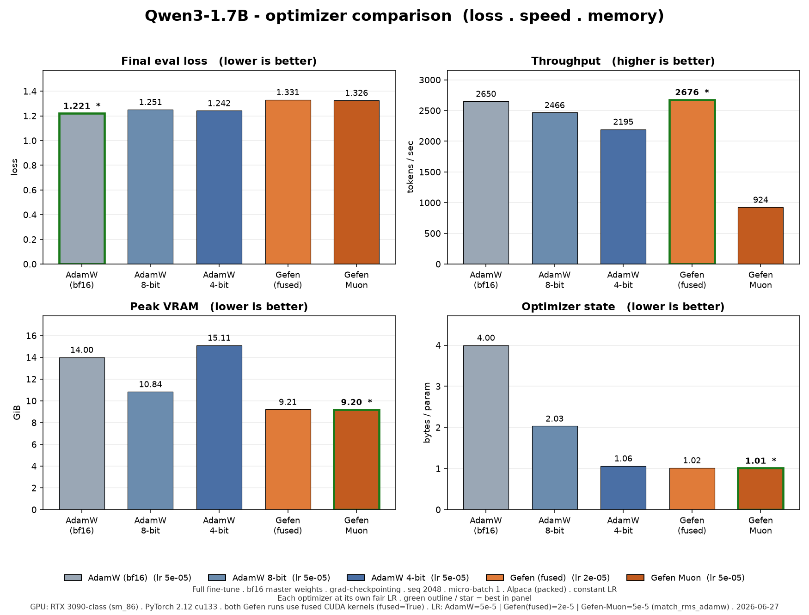
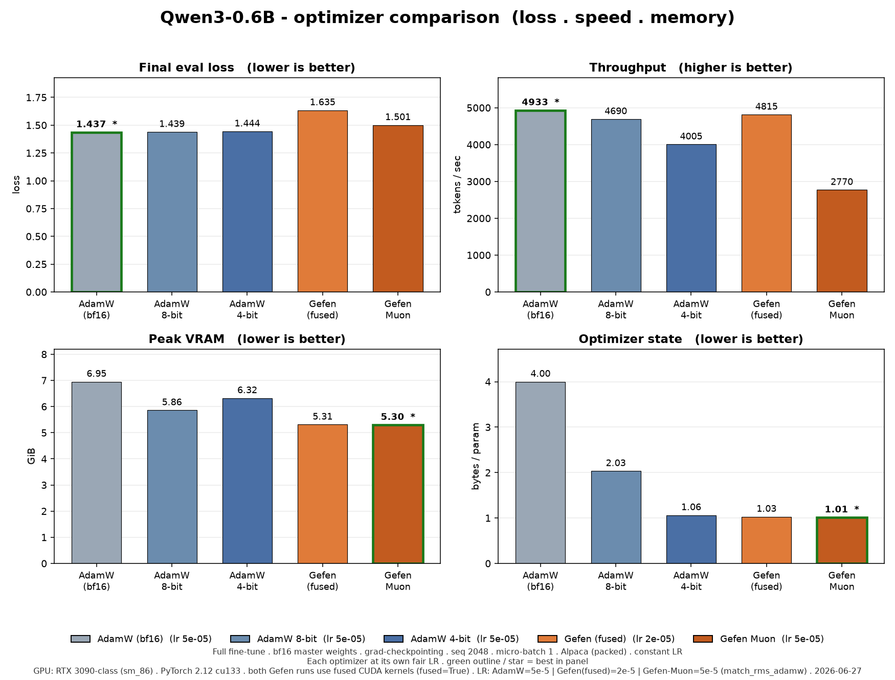
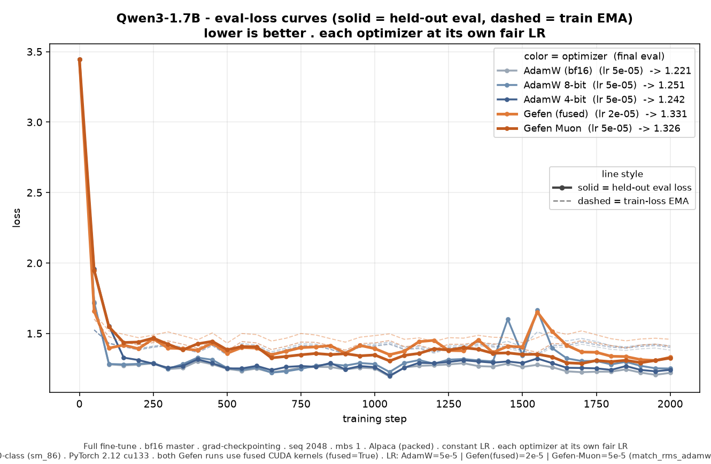
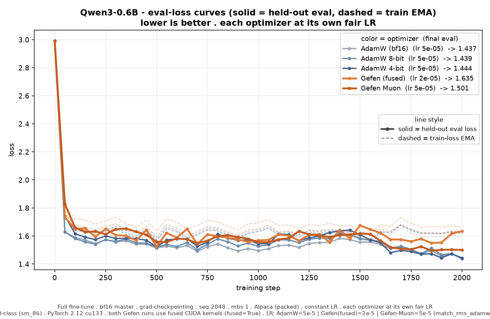
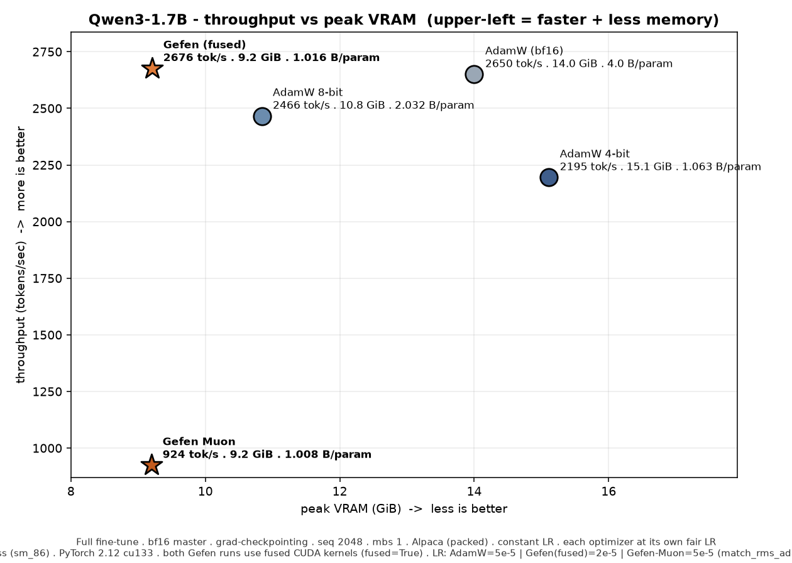
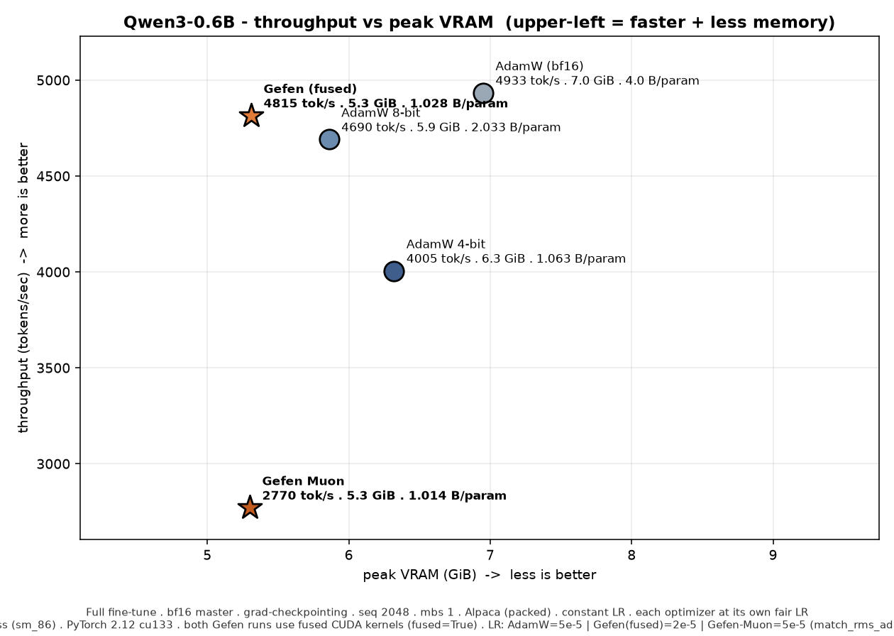

 ### `Gefen-X` Fork

**This fork of [upstream Gefen](https://github.com/ndvbd/Gefen) that fixes several critical gaps in the shipped release and adds modern-architecture support.**

 Gefen is intended to be a drop-in replacement for the AdamW optimizer for memory-efficient training. It keeps the familiar AdamW training recipe while dramatically reducing optimizer-state memory: an 8x reduction in AdamW memory footprint (about 6.5 GiB saved per billion f32 parameters), while maintaining f32 AdamW-level performance. The reduced memory footprint enables training larger models and larger batch sizes for added throughput.

**Fork Highlights:**

 - **Modern decoders (SwiGLU MLP + grouped-query attention — Qwen3, Llama-3, Mistral, …).** Upstream Gefen's block-period detector collapses to `period==1` on these architectures, falling back to per-element fp32 state (**~9 B/param — *worse*  than AdamW's 8**). A memory-safe coarse fallback restores the intended **~1 B/param**, with documented learning-rate guidance (Gefen's block-shared2nd moment needs a lower LR than AdamW — see [Learning rate](#learning-rate-when-porting-an-adamw-config)).
 - **~2× faster `opt.step()`, bit-exact.** A fused-kernel rewrite folds the 2nd-moment update, step-size, and weight decay into the update kernel with occupancy-aware v1/v2 dispatch — removing ~half the per-step kernel launches and a full gradient pass.
 - **Corrected checkpoint/resume** (dtype-on-load, block-period persistence) and **FSDP2 `fused=True` support** — broken / absent in the shipped release.
 - **Robustness hardening:** same-device/dtype guards before raw-pointer kernel launches, thread-safe SM-count caches, codebook & empty-tensor bounds checks.
 - See detailed listing in collapsible section below

 See **[Benchmarks](#benchmarks)** for a fair optimizer comparison (loss · speed · memory) with raw logs..

<details>
<summary><b>Detailed Fork Improvements</b> (vs upstream)</summary>

| Capability | Upstream v1.1.1 | This fork |
|---|---|---|
| Modern decoders (Qwen3 / Llama-3 / Mistral — SwiGLU + grouped-query attention) | uses *more* optimizer memory than AdamW on these | keeps the full ~8× memory saving |
| Learning rate on those architectures | no guidance — silently over-steps | documented ~0.6× AdamW, so quality matches AdamW |
| Optimizer-step speed | baseline | ~2× faster `opt.step()`, identical results |
| Peak memory during the step | large transient spikes | much lower peak — room for bigger models / batches |
| Sharded multi-GPU training (FSDP2) | breaks with the fast path | works — for plain Gefen *and* Muon |
| Whole-model Muon | 2D weight matrices only | `GefenMuonHybrid` trains the entire model |
| Save / resume checkpoints | can corrupt state or lose tuning on resume | saves &amp; resumes correctly |
| Crash safety | missing device / edge-case guards | guarded against wrong-device, empty-tensor, and race bugs |
| Tested correctness | no fused-kernel tests | bit-exact + distributed parity test suite |
| Getting started | no Axolotl / fork-install guidance | Axolotl how-to + fair loss/speed/memory benchmarks |

Measured numbers (Qwen3 0.6B / 1.7B) and the technical details are in [Benchmarks](#benchmarks) and the sections below.

</details>
 
## Installation

> **This fork is not on PyPI.** `pip install gefen` fetches the *upstream* release, which does **not** include the fixes/improvements above — install this fork from source instead.

Build from source (editable install):

```bash
git clone https://github.com/thad0ctor/Gefen-X
cd Gefen-X
pip install -e .          # imports as `gefen`; the fix series lives on the perf branches
```

The package is pure-Python at install time, the fused kernels (CUDA required) are **built on first use** via PyTorch JIT (`torch.utils.cpp_extension`) + `nvcc`. The first CUDA run takes a few minutes; later runs reuse the cached build keyed on your Python / PyTorch / CUDA version and the Gefen source checkout. Force a rebuild with `GEFEN_FORCE_REBUILD=1`.

**Requirements:** a CUDA toolkit and host compiler compatible with your PyTorch build (the JIT compiles for your GPU's compute capability; set `TORCH_CUDA_ARCH_LIST` to target arch or a multi-arch build). 

Verified with **PyTorch 2.12 (cu133) / Python 3.12**. Optional baselines used in the benchmark: `bitsandbytes` (AdamW-8bit),`torchao` (AdamW-4bit).

## Quick Start

```python
import torch
from gefen import Gefen

device = "cuda" if torch.cuda.is_available() else "cpu"
model = torch.nn.Linear(128, 10).to(device)

# optimizer = torch.optim.AdamW(
optimizer = Gefen(  # Replace AdamW with Gefen:
    model.parameters(),
    lr=1e-3,
    betas=(0.9, 0.999),
    eps=1e-8,
    weight_decay=0.0,
)

inputs = torch.randn(32, 128, device=device)
targets = torch.randint(0, 10, (32,), device=device)

logits = model(inputs)
loss = torch.nn.functional.cross_entropy(logits, targets)
loss.backward()

optimizer.step()
optimizer.zero_grad(set_to_none=True)

print('Finished successfully.')
```

### Learning rate (when porting an AdamW config)

Gefen matches AdamW's *interface*, but it needs a **lower learning rate** — about **0.6× AdamW's** on modern architectures tested *(Qwen3, i.e. SwiGLU MLP + grouped-query attention)*. This factor is set by the model's `head_dim`/RMSNorm block structure (see below), not its parameter count, it holds (~0.6×) across Qwen3-0.6B → 8B (all `head_dim = 128`), so re-measure only for a different architecture or `head_dim`. **At its own optimal LR, Gefen closely matches AdamW's loss and run-to-run reproducibility**, while keeping its optimizer-memory advantage.

**Why:** Gefen's second moment is a *block-shared* RMS of the gradient rather than AdamW's per-element `√v`. Globally the two take similar-magnitude steps, but on a few high-leverage tensors — most sharply the RMSNorm weights (`q_norm`/`k_norm`, whose length equals the head dim, so the whole tensor is a *single shared block*) — Gefen over-steps by ~1.5×. Those tensors set the stability ceiling, so the usable LR is ~0.6× AdamW's on modern decoder architectures *(SwiGLU MLP + grouped-query attention, e.g. Qwen3)*.

Measured on Qwen3-4B full fine-tune (each optimizer at its own optimum):

| Learning rate | Gefen vs AdamW | run-to-run spread |
|---|---|---|
| ~0.6× AdamW's (Gefen's optimum) | **matches AdamW** (ties at 300 and 800 steps) | tight (≈ AdamW) |
| 1.0× AdamW's, but AdamW-LR too hot* | ~0.3–0.4 higher | ~5× AdamW |

\* Both optimizers preferred a much lower LR than a typical AdamW default in this regime, so "1.0× AdamW's LR" above means an LR that is itself near AdamW's edge; the gap is the *extra* over-step Gefen incurs there.

The diagnostic ratio, run across the Qwen3 family, confirms the factor is size-independent — the binder is always the `head_dim`-length `q_norm`/`k_norm`:

| Model | `head_dim` | norm-binder ratio | usable LR factor |
|---|---|---|---|
| Qwen3-0.6B | 128 | 1.29 | ~0.77 |
| Qwen3-1.7B | 128 | 1.75 | ~0.57 |
| Qwen3-4B | 128 | 1.43 | ~0.70 |
| Qwen3-8B* | 128 | 1.28 | ~0.78 |

\* (8B measured with a bf16 optimizer state, which deflates its ratio → lower bound.)

When porting an AdamW recipe, **scale the learning rate to ~0.6× and tune from there.** An LR comfortable for AdamW can sit past Gefen's stability edge, and Gefen does *not* tolerate raising the LR back up. The exact factor is set by the architecture's RMSNorm/block structure, so confirm on your own model — the simplest check is to compute, on a warmed AdamW state, `‖m̂/(√v̂+ε)‖ / ‖m̂/(√blockmean(v̂)+ε)‖` for the norm-weight tensors; that ratio is the LR scale factor.

**If your recipe uses a nonzero `weight_decay`:** AdamW (and Gefen) apply *decoupled* weight decay, so the per-step regularization is `lr × weight_decay`. Scaling `lr` down to ~0.6× therefore weakens decay by the same factor. To hold regularization constant, scale `weight_decay` up correspondingly (≈ `1 / 0.6`), or retune it. (Our measurements used `weight_decay = 0`, so this follows from the decoupled-decay definition rather than direct testing.)

## Benchmarks

Optimizer comparison on a full fine-tune, **with each optimizer at its own fair learning-rate optimum** (from a per-optimizer LR sweep), 2000 steps.

> Measured on the fused-kernel performance series commits unique to Gefen-X as of `191817d`

**Testing environment**
- **Hardware:** NVIDIA RTX 3090 (Ampere, sm_86), single GPU per run.
- **Software:** PyTorch 2.12.0 (cu133), Python 3.12; Gefen fused CUDA kernels JIT-built for sm_86.
- **Models:** Qwen3-0.6B and Qwen3-1.7B — full fine-tune (all weights trained, no adapters).
- **Regime:** bf16 master weights, gradient checkpointing, sequence length 2048, micro-batch 1, Alpaca greedy-packed to 2048-token blocks, 2000 steps, single seed, identical data order across optimizers; 32-example held-out eval.
- **Learning rate (each at its own fair optimum):** AdamW (bf16 / 8-bit / 4-bit) = `5e-5`; Gefen (fused) = `2e-5`; Gefen-Muon = `5e-5` (with `adjust_lr_fn="match_rms_adamw"`).
- **Optimizers:** `adamw_bf16` = torch fused AdamW · `adamw8bit` = bitsandbytes · `adamw4bit` = torchao · `gefen_fused` = `Gefen(fused=True)` · `gefen_muon` = `GefenMuonHybrid(..., fused=True)` (Muon on 2D hidden matrices, Gefen on everything else). **Both Gefen runs use the fused CUDA kernels** (`fused=True`).

| Model | Optimizer | LR | Eval loss | tok/s | Peak VRAM (GiB) | Opt-state B/param |
|---|---|---|---|---|---|---|
| Qwen3-0.6B | adamw_bf16 | 5e-5 | **1.437** | 4933 | 6.95 | 4.00 |
| Qwen3-0.6B | adamw8bit | 5e-5 | 1.439 | 4690 | 5.86 | 2.03 |
| Qwen3-0.6B | adamw4bit | 5e-5 | 1.444 | 4005 | 6.32 | 1.06 |
| Qwen3-0.6B | **gefen_fused** | 2e-5 | 1.635 | 4815 | 5.31 | 1.03 |
| Qwen3-0.6B | **gefen_muon** | 5e-5 | 1.501 | 2770 | **5.30** | **1.01** |
| Qwen3-1.7B | adamw_bf16 | 5e-5 | **1.221** | 2650 | 14.00 | 4.00 |
| Qwen3-1.7B | adamw8bit | 5e-5 | 1.251 | 2466 | 10.84 | 2.03 |
| Qwen3-1.7B | adamw4bit | 5e-5 | 1.242 | 2195 | 15.11 | 1.06 |
| Qwen3-1.7B | **gefen_fused** | 2e-5 | 1.331 | **2676** | 9.21 | 1.02 |
| Qwen3-1.7B | **gefen_muon** | 5e-5 | 1.326 | 924 | **9.20** | **1.01** |




**Loss curves** — loss over the 2000 steps. For each optimizer (distinguished by **color**), there are two lines: **solid = held-out eval loss** (the 32-example validation set, logged every 50 steps — this is the comparison metric in the table above) and **dashed = train-loss EMA** (exponential moving average of the training loss). 

Gefen-fused converges stably and its eval curve tracks just above the AdamW cluster (the ~0.1–0.2 loss gap), with no instability at its fair LR. **Gefen-Muon recovers most of that gap**, its curve sits between Gefen-fused and the AdamW cluster, most visibly at 0.6B where it closes the gap to the best AdamW from +0.198 to +0.064.




**Throughput vs peak VRAM** — the speed/memory frontier (upper-left = faster *and* lighter is better). Gefen-fused sits alone in the best corner; AdamW-4-bit is worst on *both* axes despite its small optimizer state (torchao transient buffers). 

Gefen-Muon shares Gefen-fused's lowest-VRAM column but sits far lower on throughput — the Newton-Schulz orthogonalization makes it the slowest optimizer.




**Gefen Hybrid** At its fair LR, **Gefen-fused has the lowest peak VRAM and the lowest optimizer-state footprint, with competitive-to-best throughput** (fastest at 1.7B on sm_86) — at a **modest loss cost** (~0.1 at 1.7B, ~0.2 at 0.6B) vs the best-tuned AdamW. Note that AdamW-4-bit's optimizer state is also small (~1.06 B/param) but its **peak VRAM is the highest** (torchao compiled-step transient buffers), so Gefen, not 4-bit, is the real peak-memory winner. Gefen's clear optimizer-state edge is over 8-bit (2.03) and bf16 (4.00).

**Gefen-Muon** (`GefenMuonHybrid`, Muon on 2D hidden matrices + Gefen elsewhere, `match_rms_adamw` LR) is the **best Gefen variant on loss** at both scales — 1.501 @0.6B (vs Gefen-fused 1.635) and 1.326 @1.7B (~tied with Gefen-fused, +0.105 vs the best AdamW) — while tying Gefen-fused for the lowest peak VRAM and lowest optimizer state (~1.01 B/param). The cost is throughput: Newton-Schulz makes it the slowest optimizer (~0.58× Gefen-fused at 0.6B, ~0.35× at 1.7B). So **Gefen-fused is the speed+memory sweet spot; Gefen-Muon is the loss-recovery option** when you can afford the slowdown.

**Review the raw runs:** per-cell training logs (step-by-step loss, throughput,
VRAM) in [`docs/benchmarks/logs/`](docs/benchmarks/logs/) · aggregated metrics as
[CSV](docs/benchmarks/optimizer_comparison_2000steps.csv) and
[JSONL](docs/benchmarks/optimizer_comparison_2000steps.jsonl).

## Hugging Face Trainer

Until native `optim="gefen"` support is released in Transformers, pass Gefen to
the Trainer with `optimizer_cls_and_kwargs`:

```python
from gefen import Gefen
from transformers import Trainer, TrainingArguments

training_args = TrainingArguments(
    output_dir="outputs",
    learning_rate=1e-3,
    weight_decay=0.0,
)

trainer = Trainer(
    model=model,
    args=training_args,
    train_dataset=train_dataset,
    optimizer_cls_and_kwargs=(
        Gefen,
        {
            "lr": training_args.learning_rate,
            "betas": (training_args.adam_beta1, training_args.adam_beta2),
            "eps": training_args.adam_epsilon,
            "fused": True,
        },
    ),
)
```

### Distributed Training

Gefen is fully compatible with standard distributed training setups, including PyTorch DDP, PyTorch FSDP (including FSDP2 with `fully_shard`), and all flavors of DeepSpeed ZeRO. Gefen can be used like any other PyTorch optimizer in these workflows, with either `fused=True` or `fused=False`.


### Extension: Gefen-Muon

`GefenMuon` adds a Muon-style pseudo-orthogonalization step on the first moment (skipping the second moment), then quantizes those first moments to 8-bit with Gefen's partitioning quantization.

> **Scope — read this first.** Like Muon, `GefenMuon` optimizes **2D hidden weight matrices only**. It has *no* code path for embeddings, the LM head, or 1D parameters (norms, biases) — feeding it those will fail or misbehave. For a full model, use [`GefenMuonHybrid`](#full-models-gefenmuonhybrid) below, which routes the non-Muon parameters to `Gefen` for you.
>
> **Pass `(name, param)` pairs, not bare tensors.** `GefenMuon` keys its 8-bit codebook cache on each parameter's name. If you strip the names (e.g. `[p for _, p in pairs]`) every parameter collapses to the name `"none"` and the cache is corrupted. Always pass the named pairs through:

```python
from gefen import GefenMuon

# muon_named_params: list of (name, param) for your 2D hidden weight matrices.
optimizer = GefenMuon(muon_named_params, lr=lr)
```

#### Full models: `GefenMuonHybrid`

`GefenMuonHybrid` is the drop-in for training a **whole model** with Muon. It routes 2D hidden weight matrices to `GefenMuon` and everything else (embeddings, LM head, norms, biases) to `Gefen`, behind a single `torch.optim.Optimizer` interface. Both sub-optimizers are 8-bit, so the whole optimizer-state footprint stays small — unlike a stock Muon+AdamW setup where the AdamW half is full precision. Scope: single-GPU / DDP (FSDP2 sharded params are out of scope).

```python
from gefen import GefenMuonHybrid

def split_params_for_muon(model):
    """Muon -> 2D hidden weight matrices; Gefen backup -> everything else."""
    muon, backup = [], []
    for name, p in model.named_parameters():
        if not p.requires_grad:
            continue
        is_hidden_matrix = (
            p.ndim == 2
            and not any(k in name.lower() for k in ("embed", "wte", "lm_head"))
        )
        (muon if is_hidden_matrix else backup).append((name, p))
    return muon, backup

muon_named_params, backup_named_params = split_params_for_muon(model)

optimizer = GefenMuonHybrid(
    muon_named_params,
    backup_named_params,
    lr=lr,
    adjust_lr_fn="match_rms_adamw",  # important — see "Learning rate" below
    weight_decay=0.0,
    fused=True,
)
```

**Moun Learning rate — set `adjust_lr_fn="match_rms_adamw"`.** The Hybrid feeds a > *single* `lr` to both halves, but Muon (2D matrices) and AdamW/Gefen (everything > else) want different LR scales, so the shared `lr` is only meaningful after a per-parameter rescale:

 - **`adjust_lr_fn="match_rms_adamw"`** (recommended) rescales the Muon update to
   AdamW-equivalent RMS (`0.2·√max(rows, cols)`). Then **one AdamW-scale `lr` is
   correct for both halves**, and the [Learning rate](#learning-rate-when-porting-an-adamw-config)
   guidance above (Gefen wants ~0.6× AdamW's on Qwen3) applies to the whole model.
 - **`adjust_lr_fn=None`** (the *default*, = "original" Muon scaling
   `√max(1, rows/cols)`) leaves the Muon half on its native scale. Passing an
   AdamW-sized `lr` here **under-trains the 2D Muon matrices** — and because both
   halves share one `lr`, there's no single value that suits Muon-native *and*
   the Gefen backup. **Don't use the default with an AdamW-scale `lr`.**

It supports `step()`, `zero_grad()`, `state_dict()`/`load_state_dict()`, and LR schedulers (e.g. `torch.optim.lr_scheduler.StepLR(optimizer, ...)`) like any optimizer. Because its constructor takes two parameter lists rather than a single iterable, build it yourself and hand it to the Hugging Face `Trainer` via `optimizers=` (not `optimizer_cls_and_kwargs`):

```python
optimizer = GefenMuonHybrid(*split_params_for_muon(model), lr=training_args.learning_rate,
                            adjust_lr_fn="match_rms_adamw")
trainer = Trainer(model=model, args=training_args, train_dataset=train_dataset,
                  optimizers=(optimizer, None))  # (optimizer, lr_scheduler)
```

## Using Gefen with Axolotl

[Axolotl](https://github.com/axolotl-ai-cloud/axolotl) can train with Gefen via its `optimizer: gefen` integration — see the (draft) PR [axolotl-ai-cloud/axolotl#3755](https://github.com/axolotl-ai-cloud/axolotl/pull/3755).

> ⚠️ **Install this fork from source, not the PyPI package.** PR #3755 documents  `pip install gefen`, which pulls **upstream** Gefen — *without* this fork's fixes (the modern-arch `period==1` memory fallback, the ~2× fused kernels, the robustness guards). Install this fork from source (see [Installation](#installation)); axolotl's `optimizer: gefen` then imports whichever `gefen` is on the path..

**Basic** (memory-efficient AdamW drop-in):

```yaml
optimizer: gefen
learning_rate: 6.0e-6    # ≈ 0.6× the AdamW LR you'd use — Gefen needs a lower LR
weight_decay: 0.0
```

**Fused kernels** (recommended — ~2× faster `opt.step`, bit-exact, requires CUDA):

```yaml
optimizer: gefen
learning_rate: 6.0e-6
optim_args:
  fused: true
```

`learning_rate`, `weight_decay`, `adam_beta1`/`adam_beta2`, `adam_epsilon` are forwarded straight to the `Gefen` constructor; anything under `optim_args` (e.g. `fused`) is passed through as extra constructor kwargs.

**The levers, and where each lives:**

| Lever | How (axolotl) | Notes |
|---|---|---|
| Select Gefen | `optimizer: gefen` | added by PR #3755 |
| Fused kernels | `optim_args: { fused: true }` | ~2× faster `opt.step`; bit-exact |
| Learning rate | `learning_rate: <≈0.6× AdamW>` | Gefen over-steps at AdamW's LR on SwiGLU/GQA (Qwen3) — see [Learning rate](#learning-rate-when-porting-an-adamw-config) |
| Betas / eps / weight decay | standard `adam_beta1/2`, `adam_epsilon`, `weight_decay` | forwarded to Gefen |
| `period==1` memory fallback | *on by default in this fork* | restores ~1 B/param on modern decoders; it's the module flag `MEMORY_SAFE_FALLBACK`, not a YAML key |

**Not (yet) exposed via axolotl config:** the **Muon hybrid** (`GefenMuonHybrid` + `adjust_lr_fn`) is **not** in PR #3755 (the PR notes Muon is "more involved") — use it directly in Python per [Gefen-Muon](#extension-gefen-muon) above. `MEMORY_SAFE_FALLBACK` is a module default (on in this fork), toggled in code rather than YAML.

> PR #3755 is an early draft and marked *untested* upstream; the config keys above may change — check the PR for the current state.

## Citation:

If you found this library useful, please consider citing our work:

```bibtex
@article{benedek2026gefen,
  title={Gefen: Optimized Stochastic Optimizer},
  author={Benedek, Nadav and Koren, Tomer and Fried, Ohad},
  journal={arXiv preprint arXiv:2606.13894},
  year={2026}
}
```

## Paper:

# [Gefen: Optimized Stochastic Optimizer](https://arxiv.org/pdf/2606.13894)
