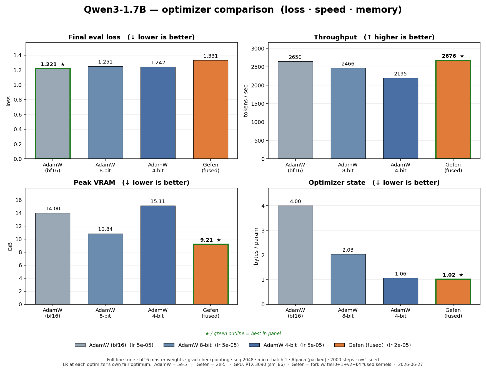
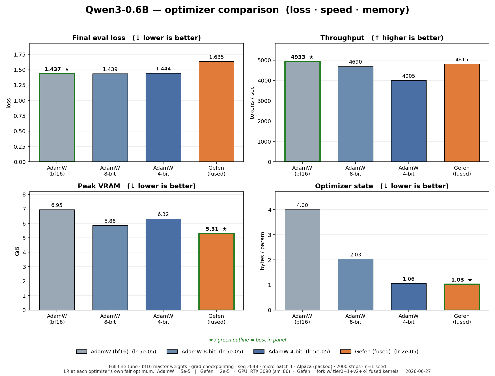

# [Gefen: Optimized Stochastic Optimizer](https://arxiv.org/pdf/2606.13894)

Gefen is a drop-in replacement for the AdamW optimizer for memory-efficient
training. It keeps the familiar AdamW training recipe while dramatically
reducing optimizer-state memory: an 8x reduction in AdamW memory footprint, or
about 6.5 GiB saved per billion parameters, while maintaining AdamW-level
performance. The reduced memory footprint lets you train larger models or use
larger batch sizes and, as a result, achieve higher training throughput.
All it takes is changing two lines of code: import Gefen and replace the AdamW
optimizer constructor.

## Installation

Install from PyPI:

```bash
pip install gefen
```

Or install from source:

```bash
git clone https://github.com/ndvbd/Gefen
cd Gefen
pip install -e .
```

On the first CUDA run, Gefen builds its fused CUDA kernels with PyTorch JIT and
`nvcc`. This can take a few minutes. Later runs reuse the cached build for the
same Python, PyTorch, CUDA version, and Gefen source checkout.

This keeps the source install lightweight, but it requires a CUDA toolkit and
host compiler compatible with your PyTorch installation. In the future, we plan
to make this smoother with prebuilt wheels for common PyTorch/CUDA combinations.

## Quick Start

```python
import torch
from gefen import Gefen

device = "cuda" if torch.cuda.is_available() else "cpu"
model = torch.nn.Linear(128, 10).to(device)

# optimizer = torch.optim.AdamW(
optimizer = Gefen(  # Replace AdamW with Gefen:
    model.parameters(),
    lr=1e-3,
    betas=(0.9, 0.999),
    eps=1e-8,
    weight_decay=0.0,
)

inputs = torch.randn(32, 128, device=device)
targets = torch.randint(0, 10, (32,), device=device)

logits = model(inputs)
loss = torch.nn.functional.cross_entropy(logits, targets)
loss.backward()

optimizer.step()
optimizer.zero_grad(set_to_none=True)

print('Finished successfully.')
```

### Learning rate (when porting an AdamW config)

Gefen matches AdamW's *interface*, but it needs a **lower learning rate** —
about **0.6× AdamW's** on the architectures we tested (Qwen3, i.e. SwiGLU MLP +
grouped-query attention). This factor is **model-specific**, not a universal
constant — it is set by the model's RMSNorm/block structure (see below), so treat
0.6× as a starting point for Qwen3-family decoders and measure it for anything
else. **At its own optimal LR, Gefen matches AdamW's loss and run-to-run
reproducibility**, while keeping its optimizer-memory advantage; reused at AdamW's
LR unchanged, it over-steps.

Why: Gefen's second moment is a *block-shared* RMS of the gradient rather than
AdamW's per-element `√v`. Globally the two take similar-magnitude steps, but on a
few high-leverage tensors — most sharply the RMSNorm weights (`q_norm`/`k_norm`,
whose length equals the head dim, so the whole tensor is a *single shared block*) —
Gefen over-steps by ~1.5×. Those tensors set the stability ceiling, so the usable
LR is ~0.6× AdamW's. This is most pronounced on modern decoder architectures
(SwiGLU MLP + grouped-query attention, e.g. Qwen3).

Measured on Qwen3-4B full fine-tune (each optimizer at its own optimum, then the
naive drop-in):

| Learning rate | Gefen vs AdamW | run-to-run spread |
|---|---|---|
| ~0.6× AdamW's (Gefen's optimum) | **matches AdamW** (ties at 300 and 800 steps) | tight (≈ AdamW) |
| 1.0× AdamW's, but AdamW-LR too hot* | ~0.3–0.4 higher | ~5× AdamW |

\* Both optimizers preferred a much lower LR than a typical AdamW default in this
regime, so "1.0× AdamW's LR" above means an LR that is itself near AdamW's edge;
the gap is the *extra* over-step Gefen incurs there.

When porting an AdamW recipe, **scale the learning rate to ~0.6× and tune from
there.** An LR comfortable for AdamW can sit past Gefen's stability edge, and Gefen
does *not* tolerate raising the LR back up. The exact factor is set by the
architecture's RMSNorm/block structure, so confirm on your own model — the simplest
check is to compute, on a warmed AdamW state, `‖m̂/(√v̂+ε)‖ / ‖m̂/(√blockmean(v̂)+ε)‖`
for the norm-weight tensors; that ratio is the LR scale factor.

**If your recipe uses a nonzero `weight_decay`:** AdamW (and Gefen) apply
*decoupled* weight decay, so the per-step regularization is `lr × weight_decay`.
Scaling `lr` down to ~0.6× therefore weakens decay by the same factor. To hold
regularization constant, scale `weight_decay` up correspondingly (≈ `1 / 0.6`), or
retune it. (Our measurements used `weight_decay = 0`, so this follows from the
decoupled-decay definition rather than direct testing.)

## Benchmarks

Optimizer comparison on a full fine-tune, **with each optimizer at its own
fair learning-rate optimum** (from a per-optimizer LR sweep), 2000 steps.

> Measured as of commit `ebb7d40` — the head of the fused-kernel performance
> series (`perf/tier0-quickwins` → `perf/tier1-kernel-fusion` → `perf/v2-fusion`
> → `perf/k4-batching`, PRs #8–#11). Update this SHA to the merge commit when the
> series lands in `main`.

**Testing environment**
- **Hardware:** NVIDIA RTX 3090 (Ampere, sm_86), single GPU per run.
- **Software:** PyTorch 2.12.0 (cu133), Python 3.12; Gefen fused CUDA kernels JIT-built for sm_86.
- **Models:** Qwen3-0.6B and Qwen3-1.7B — full fine-tune (all weights trained, no adapters).
- **Regime:** bf16 master weights, gradient checkpointing, sequence length 2048, micro-batch 1, Alpaca greedy-packed to 2048-token blocks, 2000 steps, single seed, identical data order across optimizers; 32-example held-out eval.
- **Learning rate (each at its own fair optimum):** AdamW (bf16 / 8-bit / 4-bit) = `5e-5`; Gefen (fused) = `2e-5`.
- **Optimizers:** `adamw_bf16` = torch fused AdamW · `adamw8bit` = bitsandbytes · `adamw4bit` = torchao · `gefen_fused` = `Gefen(fused=True)`.

| Model | Optimizer | LR | Eval loss | tok/s | Peak VRAM (GiB) | Opt-state B/param |
|---|---|---|---|---|---|---|
| Qwen3-0.6B | adamw_bf16 | 5e-5 | **1.437** | 4933 | 6.95 | 4.00 |
| Qwen3-0.6B | adamw8bit | 5e-5 | 1.439 | 4690 | 5.86 | 2.03 |
| Qwen3-0.6B | adamw4bit | 5e-5 | 1.444 | 4005 | 6.32 | 1.06 |
| Qwen3-0.6B | **gefen_fused** | 2e-5 | 1.635 | 4815 | **5.31** | **1.03** |
| Qwen3-1.7B | adamw_bf16 | 5e-5 | **1.221** | 2650 | 14.00 | 4.00 |
| Qwen3-1.7B | adamw8bit | 5e-5 | 1.251 | 2466 | 10.84 | 2.03 |
| Qwen3-1.7B | adamw4bit | 5e-5 | 1.242 | 2195 | 15.11 | 1.06 |
| Qwen3-1.7B | **gefen_fused** | 2e-5 | 1.331 | **2676** | **9.21** | **1.02** |




**Takeaways.** At its fair LR, **Gefen-fused has the lowest peak VRAM and the
lowest optimizer-state footprint, with competitive-to-best throughput** (fastest
at 1.7B on sm_86) — at a **modest loss cost** (~0.1 at 1.7B, ~0.2 at 0.6B) vs the
best-tuned AdamW. Note that AdamW-4-bit's optimizer state is also small
(~1.06 B/param) but its **peak VRAM is the highest** (torchao compiled-step
transient buffers), so Gefen, not 4-bit, is the real peak-memory winner. Gefen's
clear optimizer-state edge is over 8-bit (2.03) and bf16 (4.00).

*Caveats:* single seed; the `5e-5`/`2e-5` LRs are 175-step optima (the 2000-step
optimum is likely lower for every optimizer); `adamw4bit` was run at the
AdamW-family `5e-5` (its own 4-bit optimum was not separately swept). Raw data:
`docs/benchmarks/optimizer_comparison_2000steps.csv`.

## Hugging Face Trainer

Until native `optim="gefen"` support is released in Transformers, pass Gefen to
the Trainer with `optimizer_cls_and_kwargs`:

```python
from gefen import Gefen
from transformers import Trainer, TrainingArguments

training_args = TrainingArguments(
    output_dir="outputs",
    learning_rate=1e-3,
    weight_decay=0.0,
)

trainer = Trainer(
    model=model,
    args=training_args,
    train_dataset=train_dataset,
    optimizer_cls_and_kwargs=(
        Gefen,
        {
            "lr": training_args.learning_rate,
            "betas": (training_args.adam_beta1, training_args.adam_beta2),
            "eps": training_args.adam_epsilon,
            "fused": True,
        },
    ),
)
```

### Distributed Training

Gefen is fully compatible with standard distributed training setups, including PyTorch DDP, PyTorch FSDP (including FSDP2 with `fully_shard`), and all flavors of DeepSpeed ZeRO. Gefen can be used like any other PyTorch optimizer in these workflows, with either `fused=True` or `fused=False`.


### Extension: Gefen-Muon

`GefenMuon` adds a Muon-style pseudo-orthogonalization step on the first moment (skipping the second moment), then quantizes those first moments to 8-bit with Gefen's partitioning quantization.

> **Scope — read this first.** Like Muon, `GefenMuon` optimizes **2D hidden weight matrices only**. It has *no* code path for embeddings, the LM head, or 1D parameters (norms, biases) — feeding it those will fail or misbehave. For a full model, use [`GefenMuonHybrid`](#full-models-gefenmuonhybrid) below, which routes the non-Muon parameters to `Gefen` for you.
>
> **Pass `(name, param)` pairs, not bare tensors.** `GefenMuon` keys its 8-bit codebook cache on each parameter's name. If you strip the names (e.g. `[p for _, p in pairs]`) every parameter collapses to the name `"none"` and the cache is corrupted. Always pass the named pairs through:

```python
from gefen import GefenMuon

# muon_named_params: list of (name, param) for your 2D hidden weight matrices.
optimizer = GefenMuon(muon_named_params, lr=lr)
```

#### Full models: `GefenMuonHybrid`

`GefenMuonHybrid` is the drop-in for training a **whole model** with Muon. It routes 2D hidden weight matrices to `GefenMuon` and everything else (embeddings, LM head, norms, biases) to `Gefen`, behind a single `torch.optim.Optimizer` interface. Both sub-optimizers are 8-bit, so the whole optimizer-state footprint stays small — unlike a stock Muon+AdamW setup where the AdamW half is full precision. Scope: single-GPU / DDP (FSDP2 sharded params are out of scope).

```python
from gefen import GefenMuonHybrid

def split_params_for_muon(model):
    """Muon -> 2D hidden weight matrices; Gefen backup -> everything else."""
    muon, backup = [], []
    for name, p in model.named_parameters():
        if not p.requires_grad:
            continue
        is_hidden_matrix = (
            p.ndim == 2
            and not any(k in name.lower() for k in ("embed", "wte", "lm_head"))
        )
        (muon if is_hidden_matrix else backup).append((name, p))
    return muon, backup

muon_named_params, backup_named_params = split_params_for_muon(model)

optimizer = GefenMuonHybrid(
    muon_named_params,
    backup_named_params,
    lr=lr,
    weight_decay=0.0,
    fused=True,
)
```

It supports `step()`, `zero_grad()`, `state_dict()`/`load_state_dict()`, and LR schedulers (e.g. `torch.optim.lr_scheduler.StepLR(optimizer, ...)`) like any optimizer. Because its constructor takes two parameter lists rather than a single iterable, build it yourself and hand it to the Hugging Face `Trainer` via `optimizers=` (not `optimizer_cls_and_kwargs`):

```python
optimizer = GefenMuonHybrid(*split_params_for_muon(model), lr=training_args.learning_rate)
trainer = Trainer(model=model, args=training_args, train_dataset=train_dataset,
                  optimizers=(optimizer, None))  # (optimizer, lr_scheduler)
```

## Testimonials

Have you tried Gefen and want to report your impressions privately or publicly?
We would be happy to hear about your experience. With your permission, we can
credit you and mention your work here.


## Citation

If you found this library useful, please consider citing our work:

```bibtex
@article{benedek2026gefen,
  title={Gefen: Optimized Stochastic Optimizer},
  author={Benedek, Nadav and Koren, Tomer and Fried, Ohad},
  journal={arXiv preprint arXiv:2606.13894},
  year={2026}
}
```

